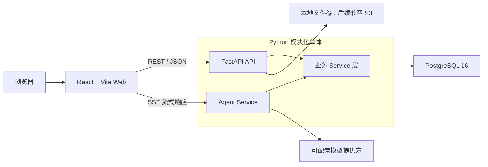
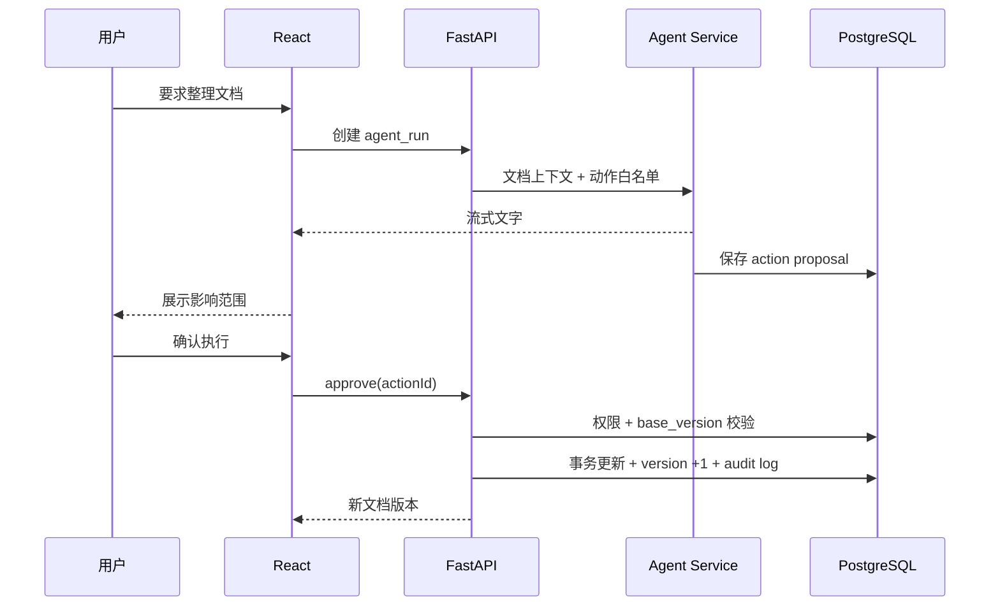
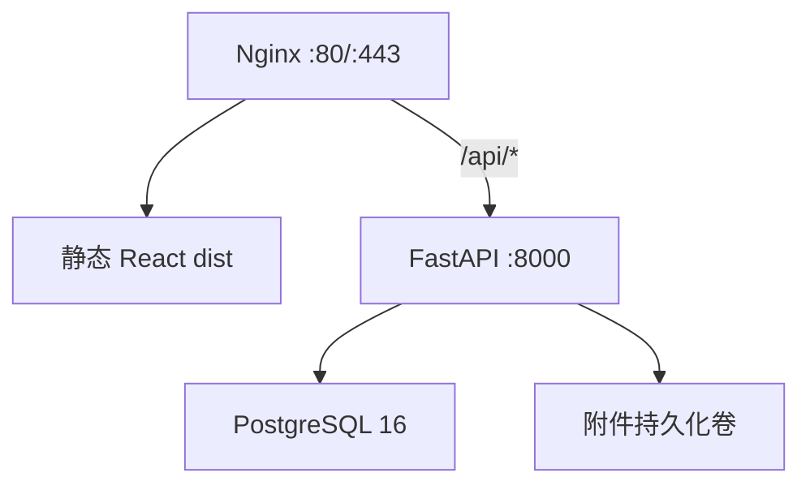

# Knowledge Workspace 技术方案（MVP）

> 目标：用最少的基础设施，尽快把现有 React 原型升级为可独立部署、数据自持的知识工作台。首版实现文档编辑、思维导图、版本记录、工作空间权限和可确认执行的智能体；聊天、会议、审批不进入首版。

## 1. 结论

采用模块化单体架构，不在首版拆微服务：

- 前端：React 19 + Vite 6，沿用当前项目；Tiptap 负责富文本，React Flow 负责思维导图。
- 后端：Python 3.12 + FastAPI + SQLAlchemy 2 + Pydantic 2 + Alembic。
- 数据库：PostgreSQL 16，关系数据用普通字段，文档和导图结构用 `JSONB`。
- 通信：业务接口使用 REST；智能体响应使用 SSE/流式 HTTP；文档保存使用 800ms 防抖和乐观锁。
- 部署：Docker Compose 运行 `web + api + postgres`，首版不强制引入 Redis、Elasticsearch、Kafka、MinIO。
- 协作策略：首版先做可靠的多人异步编辑与版本冲突提示，不直接上 CRDT；确认有多人同时编辑需求后再增加协同同步网关。

Tiptap 官方 React 指南直接使用 Vite，并通过 StarterKit 提供标题、段落、粗体等基础节点，适合快速完成编辑器；React Flow 已经存在于当前原型，可继续复用。[Tiptap React 官方指南](https://tiptap.dev/docs/editor/getting-started/install/react)

## 2. 总体架构



### 请求链路

1. React 从 `/api/v1/documents/{id}` 获取文档 JSON、版本号和权限。
2. 编辑器本地立即更新，800ms 无输入后发送保存请求。
3. FastAPI 校验用户、工作空间权限和 `base_version`。
4. SQLAlchemy 在事务中更新 `documents.content` 并把版本号加一。
5. 思维导图读取同一文档下的 `mind_maps.graph`；导图节点可通过 `source_block_id` 关联正文块。
6. 智能体读取当前文档、导图和用户指令，流式返回文字；涉及修改时只生成“动作提案”。
7. 用户确认后，后端再次检查权限和版本，再以事务方式执行动作并记录审计日志。

FastAPI 可以直接使用异步路径函数；SQLAlchemy 2 提供 `AsyncEngine`、`AsyncSession` 和异步流式查询支持，适合文档保存与模型调用并发处理。[FastAPI async 官方说明](https://fastapi.tiangolo.com/async/) · [SQLAlchemy asyncio 官方文档](https://docs.sqlalchemy.org/en/20/orm/extensions/asyncio.html)

## 3. 仓库目录

目录按你截图里的 Python 分层组织，同时把现有前端放进 `apps/web`：

```text
apps/
├── web/                         # React + Vite
│   ├── src/
│   │   ├── api/                 # HTTP 客户端、请求 DTO
│   │   ├── app/                 # 路由、Provider、全局入口
│   │   ├── components/          # 通用 UI 组件
│   │   ├── features/
│   │   │   ├── auth/
│   │   │   ├── document/        # Tiptap、工具栏、自动保存
│   │   │   ├── mind-map/        # React Flow、节点编辑
│   │   │   └── agent/           # 上下文、流式响应、动作确认
│   │   ├── pages/
│   │   ├── stores/              # 少量跨页面状态
│   │   ├── styles/
│   │   └── types/
│   ├── package.json
│   └── vite.config.ts
│
└── web-service/                 # Python FastAPI
    ├── app/
    │   ├── api/
    │   │   ├── dependencies.py  # DB、当前用户、权限依赖
    │   │   └── v1/
    │   │       ├── router.py
    │   │       └── endpoints/
    │   │           ├── auth.py
    │   │           ├── workspaces.py
    │   │           ├── documents.py
    │   │           ├── mind_maps.py
    │   │           ├── search.py
    │   │           └── agents.py
    │   ├── core/
    │   │   ├── config.py        # pydantic-settings
    │   │   ├── database.py      # AsyncEngine / sessionmaker
    │   │   ├── logging.py
    │   │   ├── security.py      # 密码、JWT、Cookie
    │   │   └── permissions.py   # RBAC
    │   ├── exception/
    │   │   ├── errors.py
    │   │   └── handlers.py
    │   ├── model/               # SQLAlchemy ORM
    │   │   ├── base.py
    │   │   ├── user.py
    │   │   ├── workspace.py
    │   │   ├── document.py
    │   │   ├── mind_map.py
    │   │   ├── agent.py
    │   │   └── audit.py
    │   ├── schema/              # Pydantic 请求/响应模型
    │   │   ├── auth.py
    │   │   ├── document.py
    │   │   ├── mind_map.py
    │   │   └── agent.py
    │   ├── service/             # 查询与业务规则
    │   │   ├── auth_service.py
    │   │   ├── document_service.py
    │   │   ├── mind_map_service.py
    │   │   ├── search_service.py
    │   │   ├── agent_service.py
    │   │   └── version_service.py
    │   ├── __init__.py
    │   └── main.py
    ├── migrations/              # Alembic
    ├── test/
    │   ├── api/
    │   ├── service/
    │   └── conftest.py
    ├── .env.example
    ├── alembic.ini
    ├── pyproject.toml
    ├── Dockerfile
    └── README.md

deploy/
├── compose.yaml
└── nginx.conf
```

### 分层边界

- `api`：只负责路由、依赖注入、输入输出，不写业务逻辑。
- `core`：配置、数据库、安全、日志等基础设施。
- `exception`：统一业务异常和 HTTP 错误映射。
- `model`：数据库表和关系。
- `schema`：API 请求/响应契约，不直接暴露 ORM 对象。
- `service`：权限之后的核心业务、事务边界、智能体动作执行。

为了加快开发，首版不再单独增加 `repository` 层；SQL 查询集中在对应 `service` 内。当查询逻辑明显膨胀时再抽出 repository。

## 4. 前端方案

### 核心依赖

| 能力 | 方案 | 原因 |
|---|---|---|
| 构建 | Vite 6 | 当前项目已可用，启动和热更新快，无迁移成本 |
| UI | React 19 | 继续使用现有组件和样式 |
| 路由 | React Router | 文档、空间、登录的页面路由 |
| 服务端状态 | TanStack Query | 缓存、重试、失效和保存状态统一管理 |
| 本地状态 | Zustand | 编辑模式、侧栏、智能体面板等少量 UI 状态 |
| 富文本 | Tiptap 3 / ProseMirror | 扩展性好，输出结构化 JSON，避免手写 `contenteditable` |
| 思维导图 | `@xyflow/react` | 当前原型已经使用，继续复用 |
| 表单 | React Hook Form + Zod | 登录、空间设置和共享设置 |
| 测试 | Vitest + Testing Library + Playwright | 单元、组件和核心流程 |

### 文档编辑器

文档以 Tiptap JSON 作为主格式，不以 HTML 作为主存储：

```json
{
  "type": "doc",
  "content": [
    {
      "type": "heading",
      "attrs": { "level": 1, "blockId": "uuid" },
      "content": [{ "type": "text", "text": "AI 产品规划" }]
    }
  ]
}
```

要求每个块拥有稳定的 `blockId`，用于：

- 导图节点关联原文；
- 智能体精准修改单个块；
- 版本比较和审计；
- 后续协同编辑迁移。

自动保存策略：

- 输入立即更新本地状态；
- 800ms 防抖后提交；
- 请求携带 `baseVersion`；
- 保存时 UI 显示“保存中 / 已保存 / 冲突”；
- HTTP `409` 时停止覆盖，提示刷新或复制当前修改。

### 思维导图

继续采用 React Flow，图数据保存在一个 JSONB 字段中：

```json
{
  "nodes": [
    {
      "id": "uuid",
      "type": "topic",
      "position": { "x": 300, "y": 200 },
      "data": {
        "label": "用户研究",
        "sourceBlockId": "uuid"
      }
    }
  ],
  "edges": [
    { "id": "uuid", "source": "root", "target": "uuid", "type": "smoothstep" }
  ],
  "viewport": { "x": 0, "y": 0, "zoom": 1 }
}
```

首版只做显式同步：用户点击“从文档更新导图”或智能体执行整理动作。不要一开始实现正文每次输入都自动重排导图，否则会带来不可预测的位置变化。

## 5. 后端方案

### Python 依赖建议

```toml
[project]
requires-python = ">=3.12,<3.14"
dependencies = [
  "fastapi",
  "uvicorn[standard]",
  "sqlalchemy[asyncio]",
  "psycopg[binary,pool]",
  "alembic",
  "pydantic-settings",
  "pyjwt[crypto]",
  "pwdlib[argon2]",
  "httpx",
  "sse-starlette",
  "orjson",
  "structlog"
]
```

开发工具：`uv`、`ruff`、`mypy`、`pytest`、`pytest-asyncio`、`coverage`。

FastAPI 不绑定特定 ORM，官方文档明确支持 PostgreSQL 等关系数据库；这里直接选择 SQLAlchemy 2，避免 SQLModel 在复杂 JSONB、索引和迁移场景下增加抽象限制。[FastAPI SQL 数据库官方文档](https://fastapi.tiangolo.com/tutorial/sql-databases/)

### 统一响应与错误

成功响应直接返回资源，不再额外包多层 `data`：

```json
{
  "id": "uuid",
  "title": "AI 产品规划",
  "version": 12,
  "content": {}
}
```

错误统一为：

```json
{
  "error": {
    "code": "DOCUMENT_VERSION_CONFLICT",
    "message": "文档已经被更新，请刷新后重试",
    "requestId": "uuid",
    "details": {}
  }
}
```

## 6. PostgreSQL 16 数据模型

PostgreSQL 16 的 `JSONB` 支持包含、路径查询和 GIN 索引，适合保存 Tiptap 文档树与 React Flow 图结构；常用筛选条件仍使用普通列，不把所有数据塞进 JSON。[PostgreSQL 16 JSONB 官方文档](https://www.postgresql.org/docs/16/datatype-json.html)

### 主要表

#### `users`

- `id uuid pk`
- `email citext unique`
- `display_name varchar(80)`
- `password_hash text`
- `status varchar(20)`
- `created_at / updated_at timestamptz`

#### `workspaces`

- `id uuid pk`
- `name varchar(120)`
- `slug varchar(120) unique`
- `owner_id uuid fk users`
- `settings jsonb`
- `created_at / updated_at`

#### `workspace_members`

- `workspace_id uuid`
- `user_id uuid`
- `role varchar(20)`：`owner/admin/editor/viewer`
- 复合主键 `(workspace_id, user_id)`

#### `documents`

- `id uuid pk`
- `workspace_id uuid fk`
- `parent_id uuid null`：目录树
- `type varchar(20)`：`document/folder`
- `title varchar(300)`
- `content jsonb`：Tiptap JSON
- `plain_text text`：搜索与模型上下文
- `version bigint default 1`
- `created_by / updated_by uuid`
- `created_at / updated_at / deleted_at timestamptz`

关键索引：

- `(workspace_id, parent_id, updated_at desc)`
- `(workspace_id, updated_at desc)`
- `GIN (content jsonb_path_ops)`：仅在确实需要按结构查询时启用
- `pg_trgm` GIN：用于中文标题和正文模糊搜索

#### `document_versions`

- `id uuid pk`
- `document_id uuid fk`
- `version bigint`
- `content jsonb`
- `title varchar(300)`
- `created_by uuid`
- `reason varchar(30)`：`manual/interval/agent/import`
- `created_at timestamptz`
- 唯一索引 `(document_id, version)`

不要每个按键创建版本。建议手动保存、智能体修改、导入，以及持续编辑每 30～60 秒最多创建一次快照。

#### `mind_maps`

- `id uuid pk`
- `document_id uuid unique fk`
- `graph jsonb`
- `version bigint default 1`
- `updated_by uuid`
- `created_at / updated_at`

#### `agent_runs`

- `id uuid pk`
- `workspace_id / document_id / user_id uuid`
- `provider varchar(50)`
- `model varchar(100)`
- `instruction text`
- `context_version bigint`
- `status varchar(20)`：`queued/running/waiting_confirmation/succeeded/failed/cancelled`
- `usage jsonb`
- `error_code varchar(80)`
- `created_at / finished_at`

#### `agent_actions`

- `id uuid pk`
- `run_id uuid fk`
- `action_type varchar(80)`
- `target_id uuid`
- `base_version bigint`
- `payload jsonb`
- `summary text`
- `status varchar(20)`：`proposed/approved/rejected/executed/failed`
- `approved_by uuid null`
- `created_at / executed_at`

#### `audit_logs`

- `id uuid pk`
- `workspace_id / actor_id uuid`
- `resource_type / resource_id`
- `action varchar(80)`
- `before jsonb null`
- `after jsonb null`
- `request_id uuid`
- `created_at`

## 7. API 设计

基础前缀：`/api/v1`

### 鉴权

```text
POST   /auth/login
POST   /auth/refresh
POST   /auth/logout
GET    /auth/me
```

### 工作空间与文档

```text
GET    /workspaces
POST   /workspaces
GET    /workspaces/{workspaceId}/tree

POST   /documents
GET    /documents/{documentId}
PATCH  /documents/{documentId}
DELETE /documents/{documentId}
GET    /documents/{documentId}/versions
POST   /documents/{documentId}/versions/{version}/restore
GET    /search?q=产品&workspaceId=...
```

保存请求：

```json
{
  "baseVersion": 11,
  "title": "AI 产品规划",
  "content": { "type": "doc", "content": [] }
}
```

成功返回新版本 `12`；版本不一致返回 `409 DOCUMENT_VERSION_CONFLICT`。

### 思维导图

```text
GET    /documents/{documentId}/mind-map
PUT    /documents/{documentId}/mind-map
POST   /documents/{documentId}/mind-map/from-document
```

### 智能体

```text
POST   /documents/{documentId}/agent/runs
GET    /agent/runs/{runId}/events       # SSE
POST   /agent/actions/{actionId}/approve
POST   /agent/actions/{actionId}/reject
POST   /agent/runs/{runId}/cancel
```

首版动作白名单：

- `document.insert_block`
- `document.update_block`
- `document.delete_block`
- `document.append_outline`
- `mind_map.replace_graph`
- `mind_map.upsert_nodes`

禁止模型直接提交任意 SQL、任意 URL 请求或任意 Python 代码。所有动作都必须经过 Pydantic Schema 校验、权限校验和版本校验。

## 8. 智能体设计

### 提供方抽象

```python
class LLMProvider(Protocol):
    async def stream(self, messages, tools, model): ...
```

通过配置选择兼容的云端模型或本地模型，不让业务代码依赖单一供应商。数据库只保存 provider 名称和模型名，API Key 只进入环境变量或密钥服务。

### 上下文组装

首版只传：

- 当前文档标题和纯文本；
- 当前导图节点和关系；
- 当前用户指令；
- 用户允许的动作列表；
- 当前资源版本号。

长文档按标题块切分，先选相关块再送入模型。MVP 不需要先建完整向量库；PostgreSQL 全文检索能够完成基础检索与排序。[PostgreSQL 16 全文检索官方文档](https://www.postgresql.org/docs/16/textsearch.html)

### 安全执行流程



## 9. 权限和安全

- 登录态：短期访问 JWT；刷新令牌放在 `HttpOnly + Secure + SameSite=Lax` Cookie。
- 密码：Argon2id，不自己实现哈希。
- RBAC：工作空间级 `owner/admin/editor/viewer`；文档首版继承工作空间权限。
- API：所有资源查询必须同时带 `workspace_id` 范围，防止只凭资源 UUID 越权。
- CORS：生产只允许部署域名；开发允许 Vite 地址。
- CSRF：使用 Cookie 刷新令牌时对修改类请求增加 CSRF Token 或严格 Origin 校验。
- 限流：登录、智能体、导出接口分别限流。
- 审计：智能体执行、权限变化、删除和版本恢复必须写 `audit_logs`。
- 密钥：`.env` 只用于本地；生产使用 Docker Secret 或平台密钥管理。
- 删除：默认软删除，定时清理前保留恢复窗口。

## 10. 搜索策略

首版不引入 Elasticsearch：

1. 标题：B-tree + `pg_trgm` 模糊搜索。
2. 正文：保存时从 Tiptap JSON 提取 `plain_text`。
3. 中文：首版使用 `pg_trgm` 进行子串检索；需要相关度优化时，在 Python 侧分词后写入额外 `search_tokens`。
4. 结构过滤：需要查找特定节点类型时使用 JSONB 查询和 GIN 索引。

只有文档量达到百万级、复杂高亮/分词成为瓶颈后，再评估 OpenSearch/Elasticsearch。

## 11. 部署方案

### 开发环境

```text
Vite dev server :5173
FastAPI         :8000
PostgreSQL 16   :5432
```

Vite 将 `/api` 代理到 `http://localhost:8000`，避免本地 CORS 配置复杂化。

### 生产 Docker Compose



容器：

- `web`：多阶段构建 Vite，Nginx 提供静态文件并反向代理 `/api`。
- `api`：同一个 Python 镜像运行 Uvicorn。
- `postgres`：固定 `postgres:16`，启用持久化卷和健康检查。
- `migrate`：部署时一次性运行 `alembic upgrade head`。

备份：每天 `pg_dump`，保留 7 个日备份和 4 个周备份；上线前必须做一次恢复演练。

## 12. MVP 开发顺序

按一名全栈开发者估算，目标 10 个工作日完成可用 MVP：

### 第 1～2 天：工程和鉴权

- 把现有前端移动到 `apps/web`；
- 初始化 FastAPI 目录、配置、数据库、Alembic；
- 创建用户、空间、成员表；
- 完成本地登录和 `/auth/me`。

### 第 3～5 天：真实文档

- 接入 Tiptap；
- 文档树、创建、读取、保存、软删除；
- 自动保存、乐观锁、冲突提示；
- 版本快照和恢复。

### 第 6 天：思维导图

- 保存 React Flow graph；
- 节点编辑和版本号；
- 文档块与导图节点关联；
- 从文档结构生成基础导图。

### 第 7～8 天：智能体

- Provider 抽象和流式输出；
- 当前文档上下文；
- 动作提案、确认执行、审计日志；
- 总结、大纲、整理导图三个首版动作。

### 第 9 天：搜索、权限和异常

- 工作空间角色校验；
- 标题/正文搜索；
- 统一错误码、请求日志、限流；
- 空状态、失败重试、冲突状态。

### 第 10 天：部署和验收

- Docker Compose；
- 数据迁移；
- API/Service 测试；
- 文档保存、导图、智能体的端到端测试；
- 备份和恢复说明。

## 13. 首版明确不做

- 聊天、音视频、审批、日历；
- 多人同一光标级实时协同；
- 微服务、消息队列和 Kubernetes；
- Elasticsearch；
- 完整 RAG/向量知识库；
- 插件市场和任意代码执行；
- 复杂文档级 ACL，首版先继承工作空间权限。

## 14. 后续实时协作演进

当真实用户出现多人同时编辑需求后，再引入 Yjs CRDT。Tiptap 官方协作方案使用 Yjs，并推荐通过 WebSocket 同步；Hocuspocus 是其开源协作后端。[Tiptap Collaboration 官方说明](https://tiptap.dev/docs/collaboration/getting-started/overview) · [Hocuspocus 官方说明](https://tiptap.dev/docs/hocuspocus/getting-started/overview)

建议把它作为独立的“协作同步网关”，Python FastAPI 仍负责用户、权限、文档元数据、智能体和审计。这样不会为了首版实时协作而重写整个 Python 后端。

## 15. 验收标准

- 新用户可以登录并进入自己的工作空间。
- 可以创建、编辑、搜索、软删除和恢复文档。
- 断网前的编辑不会无提示覆盖其他版本。
- 文档刷新后结构和格式完全恢复。
- 思维导图可以保存节点、连线、位置和缩放状态。
- 导图节点可以定位到关联的正文块。
- 智能体可以总结、生成大纲、生成导图。
- 智能体修改前必须展示动作，确认后才写入数据库。
- 所有智能体写操作都有操作者、输入版本和变更审计。
- `docker compose up` 后可在一台服务器上完整运行。
- API 单元/集成测试和三个核心端到端流程通过。
